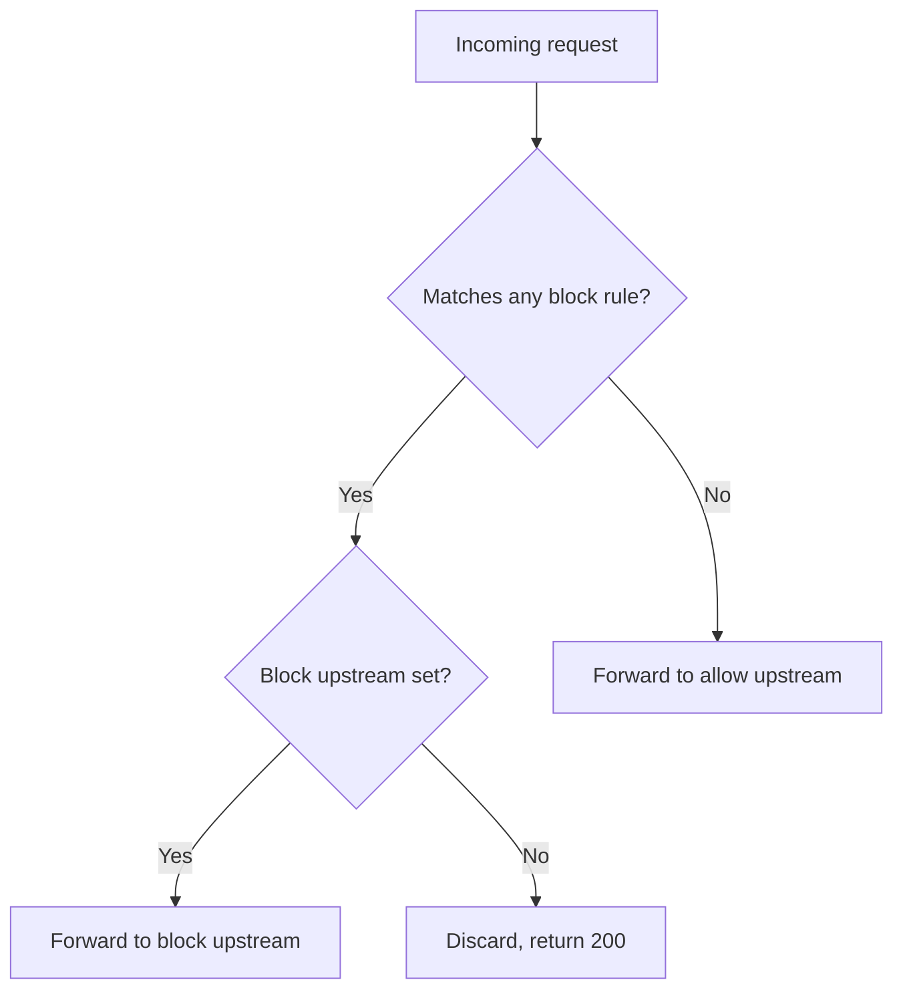

<div align="center">


**Lightweight HTTP reverse proxy for content-based request filtering and routing**

[](https://github.com/kfmndev/fltr/blob/main/LICENSE.md) [](https://go.dev) [](https://github.com/kfmndev/fltr/tags) [](https://github.com/kfmndev/fltr/actions?query=branch%3Amain)
</div>

fltr sits in front of a service and reads the content of every request it forwards. Requests that match a block rule go to a block upstream, or get discarded. Everything else goes to the allow upstream untouched.

It routes on what is inside the request, not on the path. Most proxies match a URL; fltr matches the body, the `Title`/`Message` headers, and the `title`/`message` query parameters. That makes it useful for filtering webhook and notification traffic, where every message arrives on the same path and only the payload tells you whether you want it. The rules in this repo, for example, drop Sonarr and Radarr messages about unavailable indexers.

## Table of contents

- [How it works](#how-it-works)
- [Features](#features)
- [Quick start](#quick-start)
- [Usage](#usage)
- [Configuration](#configuration)
- [Block rules](#block-rules)
- [Documentation](#documentation)
- [Development](#development)
- [License](#license)

## How it works



A request matches a rule only when every term in that rule appears in the searchable content. Rules are independent: no ordering, no precedence. Matching is case-insensitive by default; set `FLTR_CASE_SENSITIVE=true` to change that.

The searchable content is the request body, the `Title` and `Message` header values, and the `title` and `message` query parameter values. The URL path is never searched.

The incoming path is discarded. Method, headers, and body are preserved, and query parameters already present in an upstream URL are merged with the incoming ones. A body larger than `FLTR_MAX_BODY_SIZE` (default 10 MB) is rejected with `413 Content Too Large`.

At startup fltr sends an HTTP `HEAD` request to each configured upstream. Any HTTP response counts as reachable; network and TLS failures abort startup. Without a block upstream, blocked requests are discarded and the proxy responds `200 Request blocked, discarded`.

## Features

- Matches on request body, `Title`/`Message` headers, and `title`/`message` query parameters
- Blocks when every term of any one rule is present, case-insensitive by default
- Sends blocked requests to a second upstream or discards them
- Configurable listen address and maximum body size
- Text or JSON logs
- Ships as a static binary or a Docker image for `linux/amd64` and `linux/arm64`

## Quick start

fltr needs a JSON file with the block rules and an allow upstream.

**1. Create `block_rules.json`:**

```json
{
    "credentials": ["password", "secret"]
}
```

**2. Point fltr at the allow upstream and run it:**

```sh
export FLTR_ALLOW_UPSTREAM=http://allow.example.com
fltr
```

### Install

- **Pre-built binary**: download `fltr_<version>_linux_amd64` (or `linux_arm64`) from a [GitHub release](https://github.com/kfmndev/fltr/releases), make it executable, and run it.
- **Docker**: images are published to `ghcr.io/kfmndev/fltr`.

  ```sh
  docker run -d \
    --name fltr \
    -p 8080:8080 \
    -v "$PWD/block_rules.json":/config/block_rules.json \
    -e FLTR_ALLOW_UPSTREAM=http://allow.example.com \
    ghcr.io/kfmndev/fltr
  ```

- **From source**: requires [Go 1.25](https://go.dev) or newer. Run `go run .`, or `go build ./...` for a binary.

## Usage

With the example configuration above running, this request matches the `credentials` rule and is blocked:

```sh
curl -X POST http://localhost:8080 \
    -H 'Content-Type: text/plain' \
    -H 'Title: account details' \
    -d 'password secret'
```

This one matches no rule and is forwarded to the allow upstream:

```sh
curl -X POST http://localhost:8080 \
    -H 'Content-Type: text/plain' \
    -d 'hello service'
```

## Configuration

fltr is configured entirely through environment variables. `FLTR_ALLOW_UPSTREAM` is the only required one; fltr refuses to start without it.

| Variable | Required | Default | Description |
| --- | --- | --- | --- |
| `FLTR_ALLOW_UPSTREAM` | Yes | | URL for requests that do not match any block rules |
| `FLTR_BLOCK_UPSTREAM` | No | | URL for requests that match any block rules |
| `FLTR_BLOCK_RULES_FILE` | No | `block_rules.json` | Path to the JSON block rules file |
| `FLTR_CASE_SENSITIVE` | No | `false` | Enable case-sensitive rule matching |
| `FLTR_MAX_BODY_SIZE` | No | `10 MB` | Maximum request body size (for example `5 MB`, `1 GB`, `512 KB`) |
| `FLTR_ADDR` | No | `:8080` | Address where the proxy listens |
| `LOG_LEVEL` | No | `info` | Log level, such as `debug`, `info`, or `warn` |
| `LOG_FORMAT` | No | `text` | Log format: `text` or `json` (`json` only writes to stdout) |

Set a variable with `export FLTR_ALLOW_UPSTREAM=http://allow.example.com`, or prepend it to the command. The allow upstream must be reachable at startup.

## Block rules

The rules file is a JSON object. Keys name rules, and each value is a non-empty array of non-empty terms:

```json
{
    "credentials": ["password", "secret"],
    "identity": ["private-key"]
}
```

A request is blocked when it contains both `password` and `secret`, or when it contains `private-key`. Terms are trimmed when the file loads, and fltr refuses to start if any rule has no terms or a blank term after trimming.

The default location is `block_rules.json` in the current directory. `FLTR_BLOCK_RULES_FILE` points to another path.

## Documentation

The full documentation is published at [kfmndev.github.io/fltr](https://kfmndev.github.io/fltr/):

- [Configuration](https://kfmndev.github.io/fltr/configuration/): every environment variable and its defaults
- [Block rules](https://kfmndev.github.io/fltr/block-rules/): file format and matching semantics
- [Docker](https://kfmndev.github.io/fltr/docker/): images, tags, compose setup, PUID/PGID
- [Development](https://kfmndev.github.io/fltr/development/): how it works, testing, and building

## Development

Run the tests:

```sh
go test ./...
```

Generate a coverage profile:

```sh
go test ./... -coverprofile=coverage.out
```

See the [development docs](https://kfmndev.github.io/fltr/development/) for the request flow and project layout.

## License

Licensed under the [GNU Affero General Public License v3.0](LICENSE.md).
