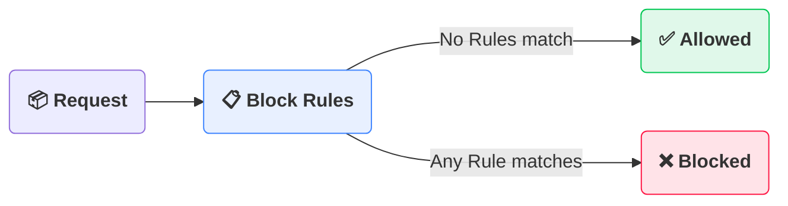
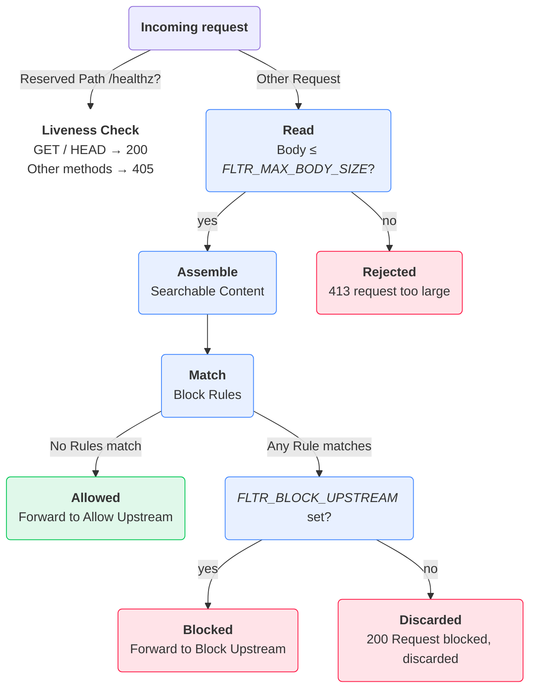

# How it works

**fltr** is a content-based HTTP request filter: it inspects the **Searchable Content** of every request, matches it against the **Block Rules**, and routes the request by its verdict. **Matching** is binary; the Block Rules have no rank or precedence over each other.

## Startup

Before fltr starts listening, it:

1. Reads the configuration and validates each upstream URL (only `http` and `https` with a hostname are accepted).
2. Sends an HTTP `HEAD` request to each configured upstream. Any HTTP response counts as reachable, including error status codes; network and TLS failures abort startup.
3. Loads the Block Rules from `block_rules.json`, or the file named by `FLTR_BLOCK_RULES_FILE`. A Block Rule with no Terms, or a blank Term after trimming, aborts startup.

## Request flow

For each incoming request:

1. **Health**: a request to the Reserved Path `/healthz` is answered by fltr itself and never reaches the filter or an upstream. `GET` and `HEAD` return `200`; any other method returns `405`.
2. **Read**: the body is read up to `FLTR_MAX_BODY_SIZE` (default 10 MB). A larger body is rejected with `413 request too large`.
3. **Assemble**: the Searchable Content is built from the request body, the `Title`/`Message` headers, and the `Title`/`title` and `Message`/`message` query parameters. Nothing in the URL path is inspected.
4. **Match**: each Block Rule is checked: it *matches* when every Term of that rule is found in the Searchable Content. A request matching any Block Rule is Blocked; a request matching no Block Rule is Allowed. See [Block rules](../reference/block-rules.md).
5. **Route** by verdict:
    - **Allowed**: forwarded to the Allow Upstream.
    - **Blocked**: forwarded to the Block Upstream when `FLTR_BLOCK_UPSTREAM` is configured; otherwise Discarded, and fltr responds with `200 Request blocked, discarded`.

## Forwarding behavior

- The HTTP method, ordinary end-to-end headers, and body are preserved; hop-by-hop headers are removed by the reverse proxy. The incoming URL path is **dropped** and the request is sent to the upstream URL as configured.
- Query parameters already present in the upstream URL are combined with the incoming query parameters.
- fltr never sets or forwards `X-Forwarded-For`, `X-Forwarded-Host`, or `X-Forwarded-Proto`: the reverse proxy strips any such headers a proxy in front of it supplied before forwarding. When fltr fronts your upstream directly, the upstream sees the hop from fltr, not the original client's details.

## Where each variable fits

- `FLTR_ALLOW_UPSTREAM` and `FLTR_BLOCK_UPSTREAM`: step 5 (routing). See [Environment variables](../reference/environment-variables.md#upstreams) for reachability semantics.
- `FLTR_BLOCK_RULES_FILE`: startup (rules loading).
- `FLTR_CASE_SENSITIVE`: step 4 (matching).
- `FLTR_MAX_BODY_SIZE`: step 2 (body reading).
- `LOG_LEVEL` and `LOG_FORMAT`: logging only; they do not affect filtering or routing.
