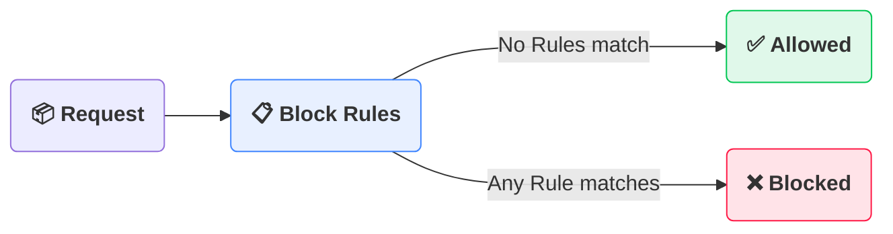

# Overview

 
<b>Lightweight HTTP reverse proxy for content-based request filtering and routing</b>
 

## What is fltr?

fltr is a lightweight HTTP reverse proxy that routes requests by inspecting the contents. It examines the [**Searchable Content**](reference/block-rules.md#matching-semantics): the request body, and selected headers and query parameters, and matches it against the [**Block Rules**](reference/block-rules.md).

Requests with no matches, i.e. allowed requests, are forwarded to the [**Allow Upstream**](reference/environment-variables.md#upstreams). Blocked requests are either proxied to the [**Block Upstream**](reference/environment-variables.md#upstreams) if it is configured, or they are discarded.

It preserves the method, ordinary end-to-end headers, and body, but drops the incoming URL path. See [HTTP behavior](reference/http-behavior.md#forwarding) for the full forwarding rules.

## Why was fltr created?

fltr was built for a chatty service that sent status updates to a [ntfy](https://github.com/binwiederhier/ntfy) topic, with no option to select which specific messages to omit. Some were frequent but of little value, while important updates got buried. fltr was written to sit between the service and ntfy and drop the unwanted messages on the way.

## Why should I use fltr?

- **Content-based filtering**: fltr looks at the [**Searchable Content**](reference/block-rules.md#matching-semantics), not just the URL.
- **Simple rules**: [**Block Rules**](reference/block-rules.md) are a JSON object of named term lists. A rule matches when every term appears in the Searchable Content, and matching is case-insensitive by default.
- **Allowed or Blocked**: requests that match no rule go to the Allow Upstream; blocked requests go to the Block Upstream when configured, or they are discarded.
- **(Almost) transparent forwarding**: fltr preserves the method, end-to-end headers, body, and query parameters, strips hop-by-hop headers, and drops the incoming URL path.
- **Lightweight**: fltr ships as one Go binary and a small container image.
- **Open source**: fltr is licensed under the AGPL-3.0.

## Where to go next

**Getting started**

- [Getting started](guide/getting-started.md): install fltr, run it, and send your first request

**Other Guides**

- [Docker](guide/docker.md): images, tags, compose setup
- [Troubleshooting](guide/troubleshooting.md): common failures and fixes
- [FAQ](guide/faq.md): recurring questions about matching and forwarding

**Reference**

- [How it works](reference/how-it-works.md): startup, matching, and routing
- [Environment variables](reference/environment-variables.md): every environment variable and its defaults
- [Block Rules](reference/block-rules.md): file format and matching semantics
- [HTTP behavior](reference/http-behavior.md): status codes, headers, and path handling
- [Glossary](reference/glossary.md): the terms fltr uses

**Internals**

- [Development](internals/development.md): project layout, testing, building, and releases
